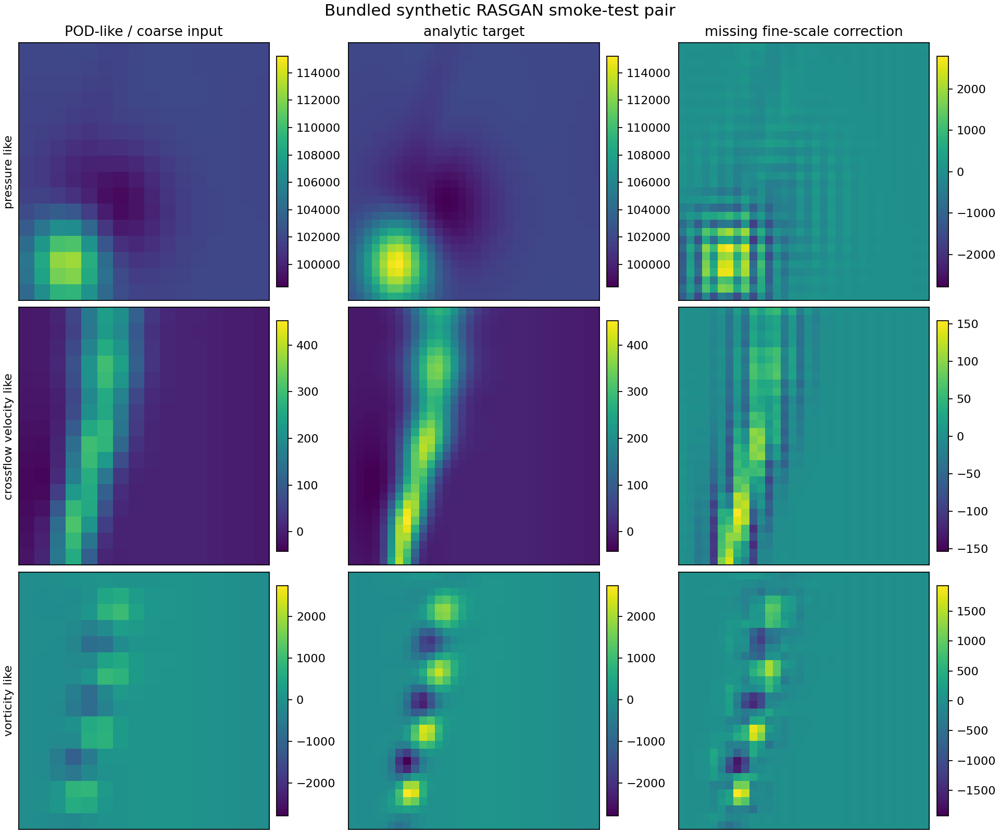
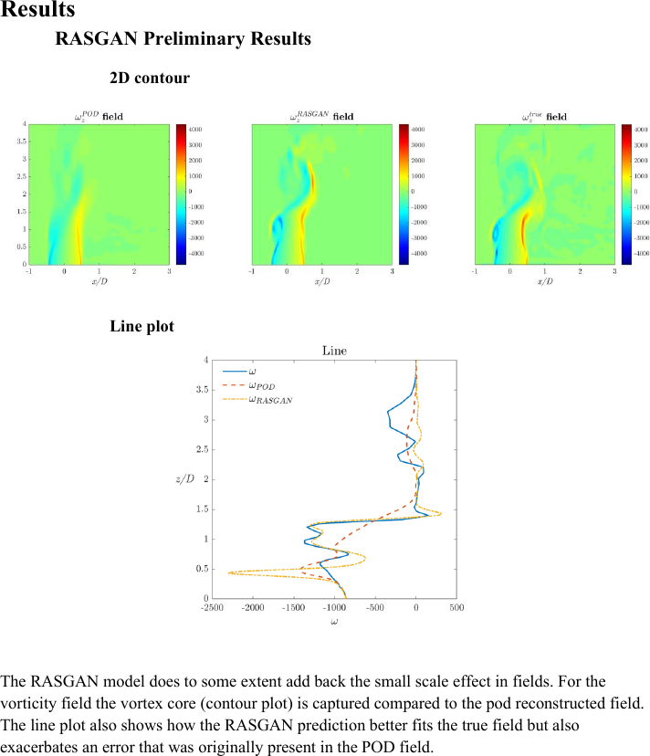

# RASGAN: Physics-Aware Flow-Field Reconstruction in TensorFlow

[](#installation)
[](#installation)
[](docs/DATA_FORMAT.md)
[](LICENSE.md)

RASGAN is a conditional relativistic GAN for reconstructing three-channel flow
fields from lower-fidelity or POD-reconstructed inputs. Early development used
the TensorLayer/SRGAN implementation as a baseline; the current codebase is a
TensorFlow/Keras scientific-field model that has been substantially redesigned
around a different residual generator, conditional discriminator, domain-specific
loss system, training controller, checkpoint format, and data pipeline.

The research application maps a coarse/POD representation of pressure,
crossflow-normal velocity, and vorticity to a higher-fidelity reference field.
The repository is intended as a **portfolio-quality methods implementation**:
it includes the complete model/training code and a redistributable synthetic
smoke test, while the private CFD datasets and production checkpoints are not
published.

<p align="center">
  
</p>

> The bundled example is analytic—not CFD, not a benchmark, and not evidence of
> physical accuracy. It exists so the package can be inspected and exercised
> without the multi-gigabyte research datasets.

## What is implemented

### Generator

- Dense residual trunk with multi-kernel `[3, 5, 7, 5, 3]` blocks, Swish
  activations, residual scaling, and Efficient Channel Attention (ECA).
- Optional same-grid refinement or 2x super-resolution.
- Resize-convolution or ICNR-initialized pixel-shuffle upsampling.
- Shared feature trunk with independent pressure, velocity, and vorticity heads.
- Optional coordinate channels.
- Experimental Transformer and composite Transformer/CNN generators with
  optional FiLM conditioning from POD coefficients.

### Conditional discriminator

The discriminator receives a 12-channel context tensor:

```text
candidate/reference field (3)
+ coarse/POD condition      (3)
+ field residual            (3)
+ learned edge maps         (3)
= 12 channels
```

It combines spectral normalization, Squeeze-and-Excitation, a PatchGAN head,
and a global logit head. Conditioning dropout, single-physical-channel passes,
and decaying instance noise are available during adversarial training.

### Loss and training system

- Balanced Charbonnier pixel loss.
- Gradient/H1 matching.
- Residual-space and low-wavenumber consistency.
- Log-amplitude and radial energy-spectrum losses.
- Total variation, feature matching, cross-channel edge decorrelation, and
  off-diagonal covariance penalties.
- Relativistic-average softplus GAN objective.
- Lazy R1 regularization on real discriminator inputs.
- Optional flow-physics residuals and POD cycle/coefficient sidecar losses.
- Two-stage content pretraining and adversarial training.
- AdamW, EMA generator weights, validation-aware learning-rate/penalty steering,
  checkpoint metadata, and restart support.
- Optional, experimental gradient-magnitude balancing of selected generator loss terms.

A more detailed mapping from the implementation to the model notes is in
[`docs/MODEL.md`](docs/MODEL.md). Intended use, limitations, and evaluation
status are summarized in [`MODEL_CARD.md`](MODEL_CARD.md). Development/runtime
validation notes are recorded separately in [`docs/VALIDATION.md`](docs/VALIDATION.md).

## Preliminary research result

The unpublished development notes include qualitative comparisons from the
research dataset. The example below shows the POD/coarse vorticity field,
RASGAN reconstruction, and reference field. It is included as a **preliminary
qualitative result**, not as a standardized benchmark.

<p align="center">
  
</p>

The full development note is archived at
[`docs/rasgan_model_notes.pdf`](docs/rasgan_model_notes.pdf).

## Repository layout

```text
src/rasgan/                    TensorFlow model, losses, physics, training, and checkpoints
src/rasgan/cli/                training, inference, preprocessing, and inspection CLIs
examples/synthetic_flow/       tiny paired three-channel example and preview
scripts/                       convenience wrappers for the package CLIs
docs/                          model, data, provenance, audit, and release notes
tests/                         data-contract, preprocessing, source, and optional TF tests
```

## Installation

A CUDA-capable TensorFlow installation is recommended for full training. Create
a clean environment and install the package:

```bash
python -m venv .venv
source .venv/bin/activate
python -m pip install --upgrade pip
python -m pip install -e .
```

For NVIDIA GPU training on a supported Linux or WSL2 system, install the
current TensorFlow CUDA extra before the editable package:

```bash
python -m pip install "tensorflow[and-cuda]>=2.17,<2.22"
python -m pip install -e .
python -c "import tensorflow as tf; print(tf.config.list_physical_devices('GPU'))"
```

Use the current official TensorFlow installation guide for driver, CUDA,
platform, and Python compatibility rather than treating these commands as a
permanent environment lock.

To regenerate the synthetic example and its figure:

```bash
python -m pip install -e ".[demo]"
```

## Quick start

### 1. Inspect the committed example

```bash
rasgan-inspect-data examples/synthetic_flow/demo_flow.h5
```

Expected paired shapes are:

```text
train LR: (32, 3, 16, 16)
train HR: (32, 3, 32, 32)
test  LR: (8, 3, 16, 16)
test  HR: (8, 3, 32, 32)
```

### 2. Build the TensorFlow models

```bash
rasgan-selfcheck
```

This compiles the package, builds the RRDB generator and 12-channel conditional
discriminator, and runs a minimal forward pass.

### 3. Run a one-epoch content-stage smoke test

```bash
rasgan-train \
  --data examples/synthetic_flow/demo_flow.h5 \
  --ckpt-dir runs/demo/checkpoints \
  --save-dir runs/demo/outputs \
  --batch-size 2 \
  --init-epochs 1 \
  --adv-epochs 0 \
  --save-every 1
```

This validates the pipeline only. The full architecture is intentionally large
relative to the toy dataset, so the resulting weights are not presented as a
useful surrogate.

### 4. Run inference from a checkpoint

```bash
rasgan-infer \
  --data examples/synthetic_flow/demo_flow.h5 \
  --weights runs/demo/checkpoints/best_init \
  --out runs/demo/predictions.mat \
  --max-n 4
```

Checkpoint `meta.json` is used to reconstruct the correct generator family and
prefer the validated raw or EMA weight set.

## Preparing private paired datasets

The public preprocessing command accepts classic MATLAB or MATLAB-v7.3/HDF5
arrays in either `C,N,H,W` or `N,C,H,W` layout:

```bash
rasgan-prepare-data \
  --hr HRresidual.mat \
  --lr LRresidual.mat \
  --hr-key HR \
  --lr-key LR \
  --input-layout cnhw \
  --train-count 2000 \
  --seed 123 \
  --out data/residual_data.h5
```

The command applies one shared permutation, computes channel statistics from
the HR training split only, applies those statistics to both LR and HR fields,
and writes compressed NCHW train/test groups. See
[`docs/DATA_FORMAT.md`](docs/DATA_FORMAT.md).

## Generator variants

```bash
# RRDB/ECA CNN (main RASGAN path)
rasgan-train --data DATA.h5 --g-arch rrdb

# Transformer generator with optional POD coefficient FiLM conditioning
rasgan-train --data DATA.h5 --g-arch transformer --pod-mat POD.mat --pod-k 4

# Composite CNN/Transformer generator
rasgan-train --data DATA.h5 --g-arch composite --pod-mat POD.mat --pod-k 4
```

The Transformer and composite paths are included because they are part of the
supplied project, but the public qualitative result shown above corresponds to
the RASGAN/CNN development path.

## Provenance and use terms

Early development used the TensorLayer SRGAN repository as a baseline:

- https://github.com/tensorlayer/SRGAN/tree/master

A source-structure comparison against the linked upstream `master` was performed
before this public packaging. The strongest retained lineage is the high-level
generator stem/trunk/skip organization, some historical SRGAN-style naming, and
the small TensorLayerX-like compatibility surface. The current residual blocks,
per-field output heads, conditional discriminator, scientific loss stack,
physics/POD terms, training controller, checkpoint system, Transformer paths,
and data pipeline are project-specific implementations.

This repository does **not** depend on TensorLayer or TensorLayerX at runtime;
`src/rasgan/tf_layers.py` implements the compatibility surface directly with
TensorFlow/Keras. Because the linked TensorLayer/SRGAN repository itself is
restricted to academic and non-commercial use, this project is released under
matching **academic and non-commercial use terms** rather than a permissive
commercial open-source license. These are source-available terms, not an
OSI-approved open-source license.

See [`LICENSE.md`](LICENSE.md),
[`THIRD_PARTY_NOTICES.md`](THIRD_PARTY_NOTICES.md),
[`docs/PROVENANCE.md`](docs/PROVENANCE.md), and the detailed
[`upstream comparison`](docs/UPSTREAM_COMPARISON.md).

## Testing

Lightweight checks do not require TensorFlow:

```bash
python -m pip install -e ".[dev]" --no-deps
python -m pip install numpy scipy h5py matplotlib pytest
pytest -m "not tensorflow"
```

With TensorFlow installed:

```bash
pytest
rasgan-selfcheck
```

## Citation

There is no associated academic paper for this model. `CITATION.cff` provides a
software citation for the repository itself.