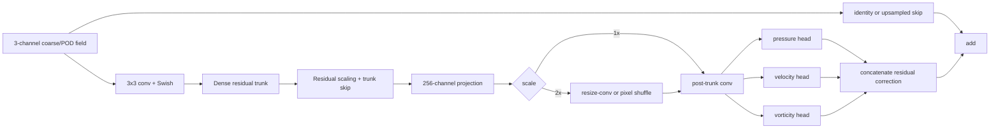
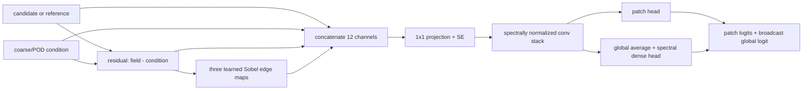

# Model overview

## Problem formulation

RASGAN learns a paired mapping

```text
coarse or POD-reconstructed field -> higher-fidelity reference field
```

for three physical channels: pressure, crossflow-normal velocity, and
vorticity. The original application uses the highest-energy POD modes as the
condition and asks the neural network to restore smaller-scale structure that
is absent from the low-rank reconstruction.

The input and output may share one grid (`scale=1`) or use a 2x spatial ratio.
Training arrays use NCHW layout.

## Main CNN generator



Each dense residual block uses a symmetric sequence of kernel sizes
`3, 5, 7, 5, 3`, internal feature concatenation, ECA attention, and 0.25
residual scaling. The supplied source sets every convolution's dilation to 1.
This is important because the development PDF describes "symmetric dilations";
the public repository documents the executable code rather than repeating that
wording.

The three output heads each contain two local residual units and a final 1x1
convolution. The head convolution is zero-initialized, so the initial generator
behaves close to the coarse-field skip connection.

## Conditional discriminator



During adversarial training, the condition/residual branches may be dropped on
a per-sample basis with an "at least one" guard. Some discriminator passes can
retain only one physical channel, encouraging the critic to evaluate each
quantity rather than relying only on cross-channel cues.

## Generator losses

The content stack includes:

1. balanced per-channel Charbonnier reconstruction;
2. central-difference gradient/H1 matching;
3. correction/residual alignment relative to the coarse input;
4. low-wavenumber consistency;
5. normalized log-amplitude spectrum matching;
6. radially binned energy-spectrum matching;
7. total variation;
8. discriminator feature matching;
9. cross-channel edge decorrelation; and
10. off-diagonal covariance suppression.

The adversarial term uses relativistic-average softplus losses. The
discriminator can apply lazy R1 regularization to its real 12-channel input and
uses decaying instance noise.

Optional terms support finite-difference flow constraints and a POD sidecar with
spatial modes plus per-snapshot coefficients. These terms are disabled when
their weights are zero.

## Training stages

### Stage A: content pretraining

Only the generator is optimized. The default configuration emphasizes robust
content reconstruction, with adversarial and feature-matching terms absent.
Validation tracks normalized and de-normalized errors.

### Stage B: adversarial refinement

Generator and discriminator updates alternate. Spectral penalties, adversarial
pressure, R1 strength, conditioning dropout, edge emphasis, instance noise, and
optional physics terms can vary over the training schedule. A validation-aware
steerer adjusts learning rates and selected penalties within configured bounds.

Generator EMA weights are maintained and checkpointed alongside raw generator
and discriminator weights. Each checkpoint stores architecture metadata,
training stage, epoch, learning rates, steering state, and enough information
to reconstruct RRDB, Transformer, or composite generators for inference.

## Experimental generator families

`TransformerSR_g` tokenizes the LR field, adds positional encoding, and can use
FiLM modulation from concatenated POD coefficients. `CompositeSR_g` combines a
convolutional residual front end with Transformer blocks. They are available
through the same training/checkpoint interface but should be presented as
experimental unless separately validated.
